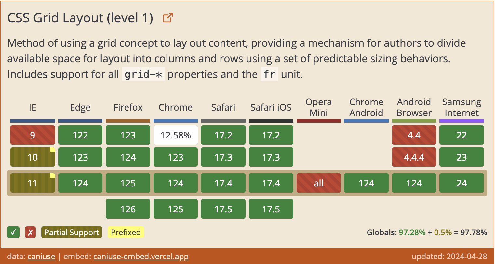

# CanIUse Embed

从[caniuse.com](https://caniuse.com/)和[mozilla的浏览器兼容数据](https://github.com/mdn/browser-compat-data)嵌入最新的数据。

显示10个主要浏览器多个版本的功能支持数据。

可配置、可靠且完全响应。

## 文档

查看 [文档](https://caniuse-embed.vercel.app/) 。

## 使用

在您的文档中插入以下 JavaScript 代码。

```html
<script type="module" src="https://caniuse-embed.vercel.app/embed.js"></script>
```

特别的，对于国内的用户，由于一些原因`vercel.app` 网站可能会无法访问。因此，可以使用以下方式替代：

```html
<script type="module" src="https://caniuse.pengzhanbo.cn/embed.js"></script>
```

将此片段粘贴到您希望显示嵌入内容的位置：

```html
<p class="ciu-embed" data-feature="{feature}" data-past="2" data-future="3" data-meta="be6d"></p>
```

## Example



## Why ?

过去，我经常在我的技术文档中，使用 [https://caniuse.bitsofco.de/](https://caniuse.bitsofco.de/)
嵌入 CanIUse 数据。然而，我发现它在嵌入时，需要加载 [@mdn/browser-compat-data](https://github.com/mdn/browser-compat-data) (`14MB`) 和 [caniuse/full-data.json](https://github.com/Fyrd/caniuse) (`4MB`)
，超过 `18MB` 的数据，然后还需要在运行时解析，最终所需要的有效数据仅不到 `10kb`。

**这太消耗流量了，严重影响了加载速度！**

因此，我决定使用 [Astro](https://astro.build/) 重新开发，部署到 [Vercel](https://vercel.com/) 。

使用 **Astro** SSR, 为每个 feature 都生成完全独立的静态页面，无需请求任何数据，每个页面体积不超过 `20kb` !

同时，使用 **Vercel** 的 ISR 能力，每 7 天 重新生成新的页面并缓存为静态文件，保证数据的实时性，无需重新部署。

## Reddit

- [mdn-browser-compat-data](https://github.com/mdn/browser-compat-data)
- [Fyrd/caniuse](https://github.com/Fyrd/caniuse)
- [ireade/caniuse-embed](https://github.com/ireade/caniuse-embed)

## License

MIT
